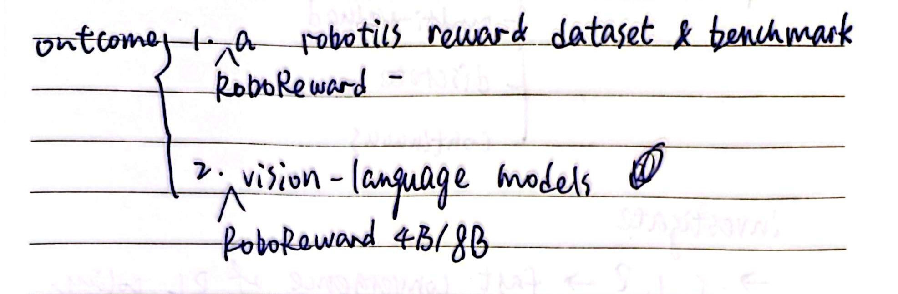
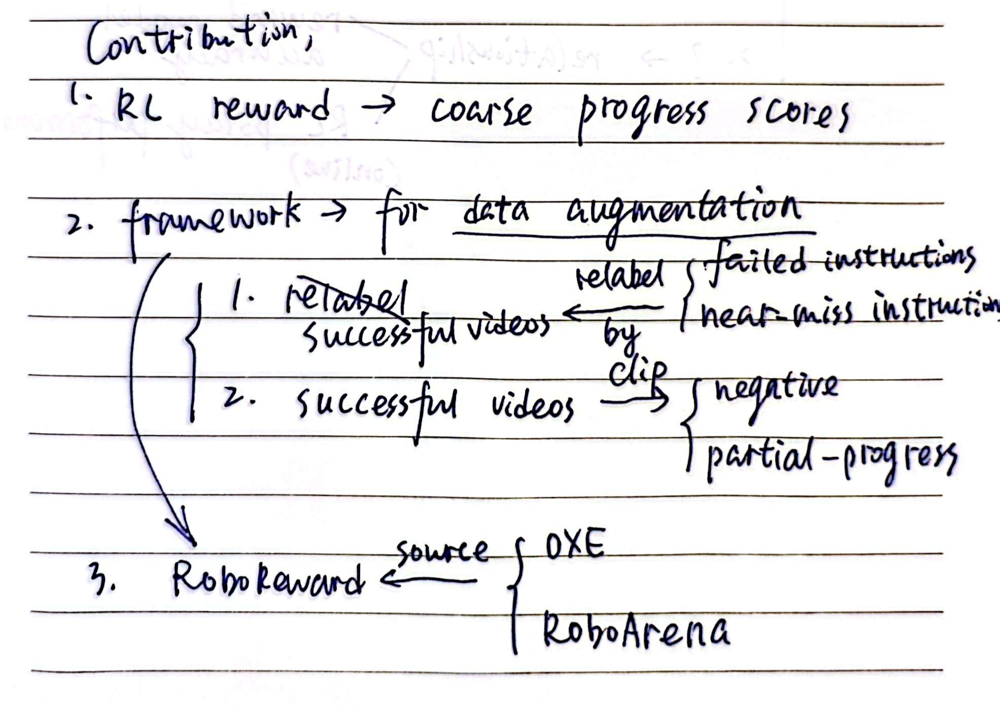

# RoboReward: General-purpose Vision-Language Reward Models for Robotics

## Outcomes

  

## Contributions

  

## Key Take-aways

### 1) 开源prompts

- 搭建一套基于开源VLM和LLM prompt engineering的离散reward逐帧标注pipeline
    - 输入：视频格式的successful robot episode
    - 输出：每一帧的离散reward（1,2,3,4,5）
    - 步骤，每一步都是prompt engineering:
        1. Prompt rewriting
        2. Negative example generation
        3. Rubric and validation
- pipeline涉及的prompts均开源，见附录A.2

### 2.1) progress reward > binary success reward
### 2.2) reward model准确度 <- 线性正相关 -> robot policy成功率

- 在构建数据集之前，本文先基于Robomimic benchmark的*仿真器*，做了两个实验，来考察
    1. reward设计 ?-> policy training fast convergence，[查看图片](images/IMG3.png)
        - 实验方法：基于3种不同的reward type，
         
            Qwen2.5-VL -(finetune on **the simulator's GT reward signal**)-> reward model -(reward varied on the type)-> RL训练 & policy update -> policy eval
    2. reward model准确度 ?-> robot policy成功率，[查看图片](images/IMG4.png)
- policy? - diffusion policy
    - pretrained on Robomimic task demonstrations
    - finetune on **GT reward given by simulator**

### 3) A pipeline for data augmentation from successful rollout videos without frabricating new videos

- 对于reward model的训练，仅使用过去policy常用的successful rollouts是不够的，negative examples（failure rollouts）是必要的.

    > Unfortunately, existing large-scale robotics datasets are heavily skewed towards successful demonstration episodes, which are poorly suited for training and evaluating reward functions for estimating both success and failure.

- Ways,
    
    见[Contributions小节](#contributions).

---

Q: 怎么理解**GT reward given by simulator** or **the simulator's GT reward signal**？

A: 本文使用了Robomimic的三个任务：lift, can, square [(Ajay Mandlekar, 2017)](https://arxiv.org/pdf/2108.03298). 由于仿真器可以得到物体在三维空间中的位置XYZ，因此可以据此设计progress reward，比如物体与目标位置的距离越小reward越大（具体设计方式本文并未说明）.

### Perspective

1. K 2.1) 符合直觉，相较于只在episode结束时给binary reward，progress reward能提供过程信息，自然让policy trial-and-error更及时地得到反馈，从而更快收敛.
2. K 2.2) 则让人非常迷惑，因其似乎是显而易见的。reward model来自于基于simulator's GT reward signal的finetune，则reward model越准确说明对仿真器的reward signal的拟合程度越好。除非policy训得有问题，否则reward model越准确，policy成功率当然越高.