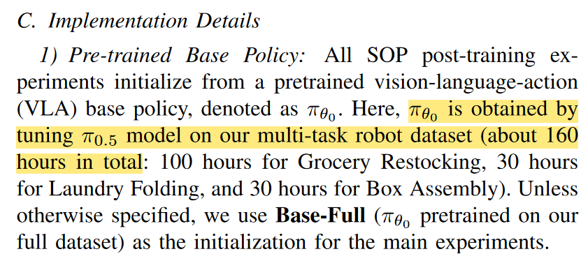

# Reading - SOP: A Scalable Online Post-Training System for Vision-Language-Action Models 

## Methodology of SOP
SOP utilizes a closed-loop actor-learner architecture that tightly couples robot execution with centralized cloud learning.

- Distributed data collection (Actors): A fleet of robots operates in parallel across various tasks, continuously streaming "on-policy" experience and human intervention signals to a centralized cloud learner.

- Centralized cloud learning: The cloud learner samples from a mixture of fresh online interaction data and a static offline buffer of prior demonstrations. It uses an adaptive sampling strategy that balances tasks and prioritizes data where the current policy's loss is high.

- Asynchronous model updates: Refreshed policy parameters are broadcast back to the entire robot fleet at short intervals (typically seconds to tens of seconds), enabling low-latency adaptation.

- Algorithm-agnostic design: SOP defines the system-level dataflow and can work with various post-training algorithms; the paper demonstrates this using both HG-DAgger (interactive imitation learning) and RECAP (reinforcement learning).

Q: 虽然RECAP主要是一种post-train idea，但其与预训练模型不解耦（毕竟有一个binarized indicator），但SOP中说用到的base policy是从pi 0.5用自己数据训出来的，所以他们究竟是怎么用RECAP的呢？

  

## Key Takeaways

- Rapid proficiency gains: SOP enables VLA models to reach expert-level performance in hours rather than days. It consistently achieves significantly higher success rates and roughly 2x higher throughput than standard offline or single-robot methods.

- Bigger fleet faster training (near-linear scalability): Training efficiency scales almost proportionally with the size of the robot fleet. For example, a 4-robot fleet reached performance targets 2.4x faster than a single robot.

- Preservation of generality: Unlike task-specific fine-tuning, SOP maintains a single shared policy that improves on specific tasks while preserving its general-purpose capabilities.

- On-policy correction (Better) vs. offline data (Worse): The researchers found that just 3 hours of on-policy interaction through SOP yielded significantly better performance than adding 80 hours of additional static human demonstrations. This is because SOP targets the specific failure modes of the deployed policy.

- Real-world robustness: In long-horizon evaluations, tasks like laundry folding and box assembly ran continuously for over 36 hours without performance degradation.